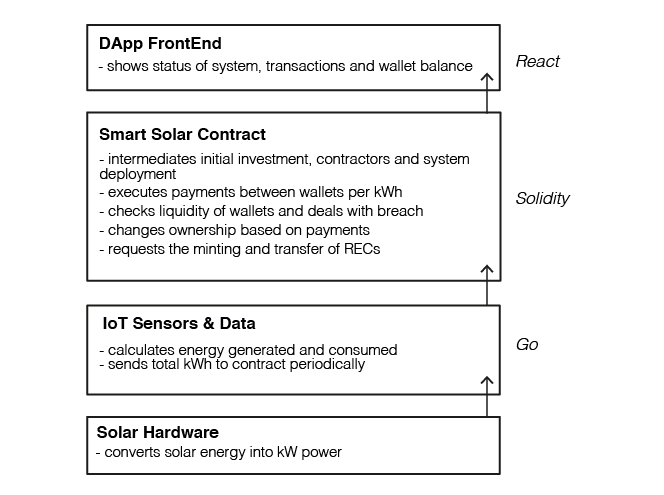

# SmartSolar Property & Payment Contracts

Under development, not to be used with real contracts and money to pay for solar energy....yet!

Overall Project Abstract: We are designing an integrated system of robust and affordable public financing for solar infrastructure. Our blockchain and hardware engineering, and field efforts, are geared to consolidate a model to transform all of Puerto Rico’s public schools into solar-power emergency shelters, and nodes in community-based microgrids. 

Learn more at dci.mit.edu and openlab.yale.edu

#### Main Smart Solar Contract Idea 
Investors can finance solar photovoltaic systems around the world with several layers to de-risk their investment and certify the project's social and environmental value. End users can receive the solar systems with no downpayment, pay for the energy per kWh just like they do with the current utility, but once they pay off the cost of the system plus a low interest (i.e. a return to investors), they will fully and legally own the system (zero energy cost thereafter). 

The main financial investment model considered here is that of the issuance of a municipality bond as the debt instrument. Other models can include equity crowd-funding and normal crowdfunding. With the municipal bond, the issuer (eg. end-user) issues a bond through a platform (eg. neighborly), and the investors buy enough bonds (at different values) to cover the principal (i.e. capex) of the solar system. The smart solar contract will organise bidding processes with contractors (i.e. solar developers), pay out contractors and inform when the system is 'live'. 

Different layers of IoT energy monitoring devices will inform of the energy generated by the solar system and the energy consumed by the end-user. This energy data (eventually using an oracle as intermediary) activates payment transactions per kWh at a specified tariff rate (e.g. also using an oracle to determine the normal tariff) and at specific intervals (eg. monthly). Energy payment transactions occur between the end-users wallet/account and a main escrow smart contract that accrues the funds and issues payment of interests (i.e. coupons) to investors. Once the accrued funds can cover the original principle, the contracts pays off investors and the bonds matures.

Other relevant contract layers include risk mitigation processes to deal with payment breaches (i.e. end-user doesn't pay for energy), and the issuance/minting of Renewable Energy and Carbon Certificates based on the kWh energy reported by the IoT devices. 

#### Contract overview
(this sections needs to be updated)
Each energy producer/component (eventually becoming a peer in a transactive microgrid) will serve as a “lite client” that has access to/exists as an address on the Ethereum blockchain. This address/client will hold funds and continuously execute contract calls on the solar property contract and observe the returned data. With this data, the client will determine if funds are sufficient to continue providing energy from the connected renewable energy source.

#### Key Terms

Infura - An API built by a spoke of Consensys in order to open access to the blockchain through familiar REST patterns.

CloudMQTT - Message queueing service. This system acts as a buffer for data and actions that need to be forwarded. Received messages are organized under “topics” that other devices/servers can listen to. These listeners will be pinged when the topic receives new messages. It’s resources are hosted on AWS

Blockchain - A smart contract will be published on the Ethereum blockchain. This contract will contain the logic for payments by microgrid participants. It will keep track of ownership and transfer ownership as needed (when payments aren’t fulfilled). 

#### Current Implementation
(this section needs to be updated)
The script found in PhotonClient can be run on the photon which will publish a message to a topic “testTopic” on the MQ. The server code (in InfuraClient) written in go (based on bdjukic's go implememntation) can be run on a local machine to simulate how a cloud hosted server would respond. The server will listen to the topic ”testTopic” and when a message is posted will make an infura call to a dummy contract that was published at "0xec67fad6efe7346d18c908275b879d04454a3dd0". The current transaction doesn’t need gas/to be signed because it’s an eth_call which doesn’t alter or publish to the contract but simply requests information. The InfuraClient will receive the result of the function call.

The current structure for the contract enables new "Solar Systems" to be added, which will be the hardware components that are contributing energy to the system. There is one special role in this contract, which is that of the *approver*. Only the approver has the capability to register new Solar Systems. Each system can be "held" by various parties, also recorded through the contract, where each party holds some portion of the system. When a party makes a payment to the system, they will not only be paying for the energy usage, but also paying off their holding until they eventually own their portion of the system. If a party fails to pay for the energy they have consumed, they will have a grace period over which they can make this late payment; otherwise, the energy coming from the portion of the system that they previously held will be sold back to the grid.

#### Next Steps
(this section needs to be updated)
The software components are connected and functional. Now we need to begin writing the necessary code that will work with the energy data. We need to parse and hash energy data that is received by the hardware system. Then, write photon script that will publish this data on the MQ service. At the same time, we are working to publish a prototype smart contract (`SolarProperty.sol`) on the testnet that will have the property transaction logic. 

#### Possible Alternative system: 
Because the Raspberry Pi is used in the system as a controller for how energy should be routed from the solar panels, we should explore using the Pi as the main point of communication with the blockchain. The Pi should have the capabilities to make direct HTTP calls using Infura to the blockchain which would completely avoid the need of using the message queuing service and hosting another server. This is advisable because the message queuing service and Go server would be hosted on centralized services and cost more money to maintain. 
The Pi would receive all the sensor data from the batteries/solar panels/critical loads and make smart contract function calls that the Go server previously was making. The smart contract would directly return results to the Pi. The Pi can then proceed with determining how the energy in the system should be distributed.

For more information, and how to collaborate, contact martin.wainstein@yale.edu
